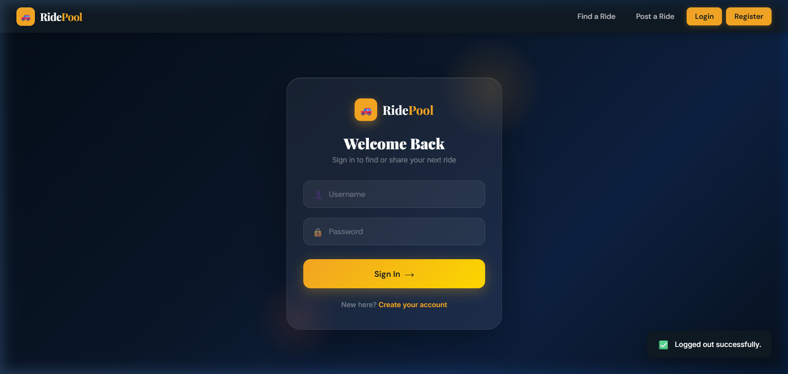
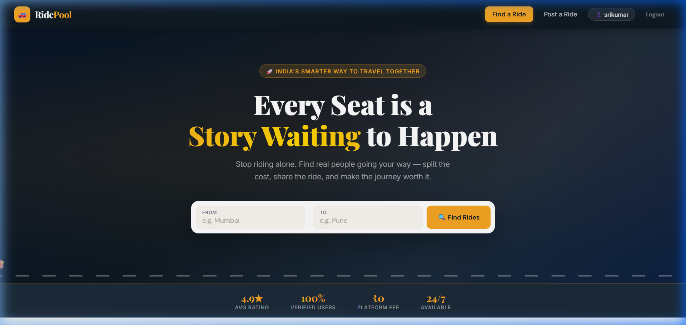
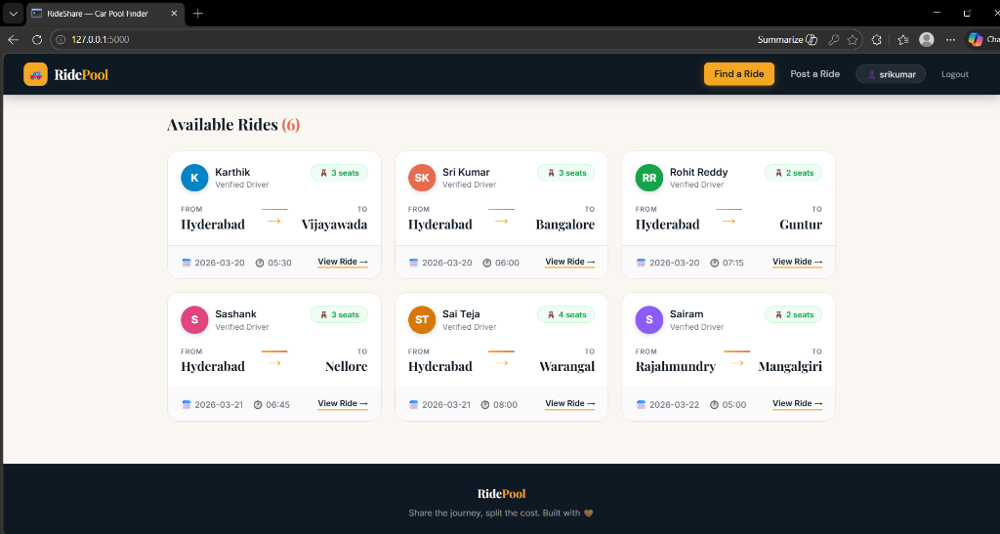
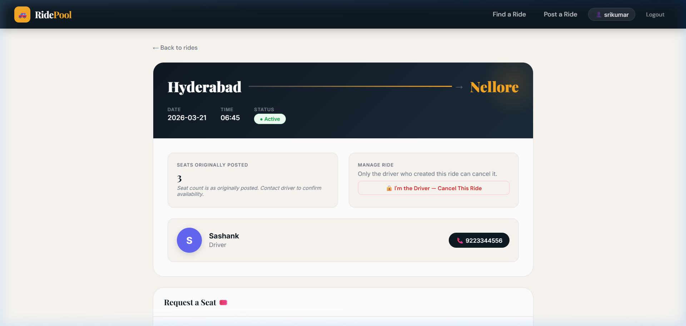
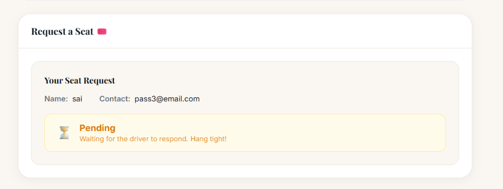
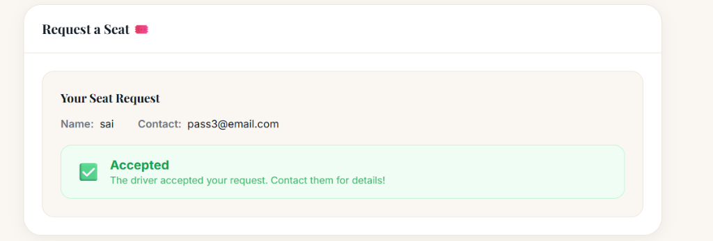
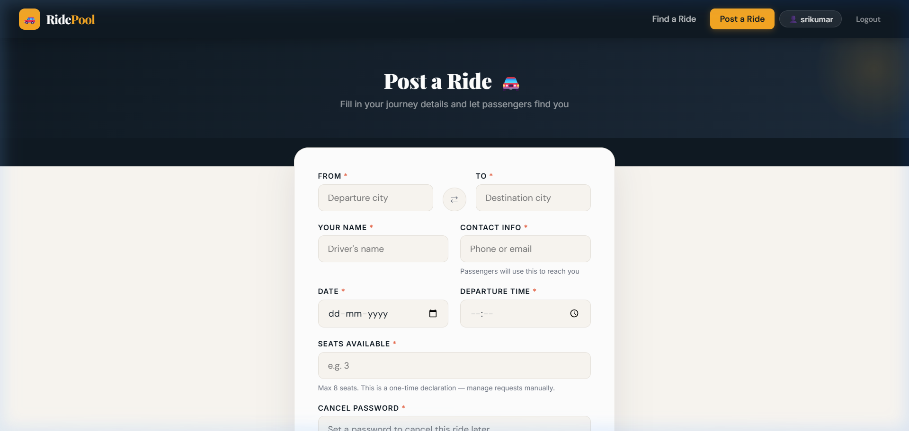
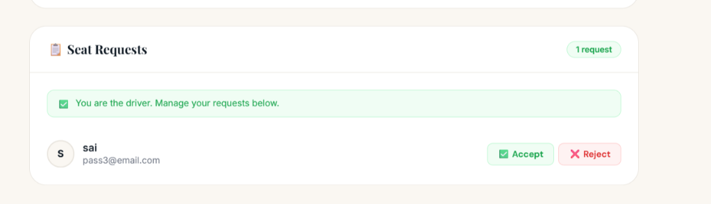
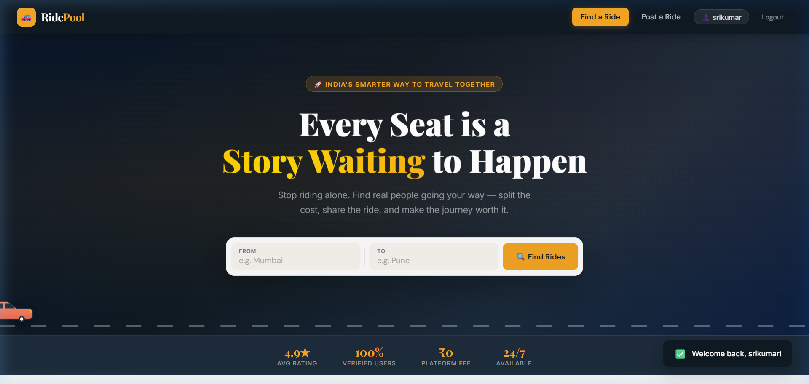

# RidePool Finder MVP 🚗
A lightweight Car Pool Finder MVP built with Python/Flask, SQLite, and pristine Vanilla JavaScript/CSS. No Bootstrap dependency. Share the journey, split the cost.

<div align="center">
  
  
  
  
</div>

## Project Structure
```text
/
├── app.py             # Main Flask routing block & logic
├── database.py        # SQLite schema initialization script
├── requirements.txt   # Pip dependencies
├── carpool.db         # SQLite data (ignored in version control)
├── static/
│   └── styles.css     # Fully custom Vanilla CSS variables and layouts
└── templates/
    ├── base.html      # Parent Jinja base providing Nav & Toast logic
    ├── index.html     # Homepage SPA logic (Hero, Stats, Filtered Grid)
    ├── post_ride.html # Standalone 2-column post creation card
    └── ride_detail.html # Split 2/3 ratio detail layout & requests
```

## Local Setup

**1. Clone the repository**
```bash
git clone https://github.com/Madhu-0007/Ridepool-finder.git
cd Ridepool-finder
```

**2. Create a Virtual Environment (Optional but recommended)**
```bash
python -m venv venv
venv\Scripts\activate   # On Windows
# source venv/bin/activate  # On macOS/Linux
```

**3. Install Dependencies**
```bash
pip install -r requirements.txt
```

**4. Initialize the Database**
*This will automatically generate your `carpool.db` based on the internal `rides` and `requests` mapping schema.*
```bash
python database.py
```

**5. Boot the Application**
```bash
python app.py
```
*Head over to http://127.0.0.1:5000 in your browser to start posting rides!*

## Features & Demo

### 1. Secure Authentication & Premium Login
The app features a fully custom glassmorphism login and registration portal. It handles hashed passwords and session-based authentication completely natively.
<br>


### 2. Interactive Hero & Real-Time Search
The dashboard welcomes users with a premium dark hero section showcasing animated SVG vehicles with exhaust trails. A unified search bar allows users to instantly filter active rides by origin and destination.
<br>


### 3. Responsive Ride Grid Layout
Available rides are rendered in a clean, fully responsive css-grid (scaling up to 3 cards per row). Each card dynamically generates driver initials and maps them to a unique color palette, alongside route mapping and seat metrics.
<br>


### 4. Dedicated Ride Detail & Passenger Requests
Clicking into a ride provides a dedicated full-page view mapping the entire journey. Passengers can submit a seat request with their contact details. The system prevents duplicate requests natively via SQLite unique constraints.
<br>

<br>

<br>


### 5. Posting a New Ride & Driver Controls
Drivers can seamlessly post new rides through a clean, 2-column interactive form specifying source, destination, seats, and a unique cancellation password.
<br>


### 6. Ride Management (Accept/Reject & Close)
Drivers have an exclusive view to Accept or Reject pending requests from passengers securely. Additionally, rides can be safely manually marked complete/closed by the driver matching their original verification password string.
<br>


### 7. Animated Toast Notifications
Contextual real-time feedback (success, error, auth warnings) securely driven by native Vanilla JS capturing Flask session flash messages.
<br>

